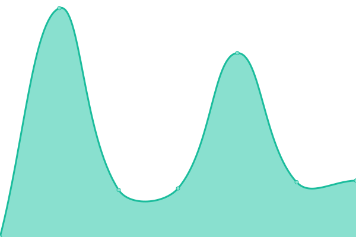

# [📈 Live Status](https://UnivTerbuka.github.io/online): <!--live status--> **Semua sistem beroperasi**

This repository contains the open-source uptime monitor and status page for [Universitas Terbuka](https://www.ut.ac.id/), powered by [Upptime](https://github.com/upptime/upptime).

With [Upptime](https://upptime.js.org), you can get your own unlimited and free uptime monitor and status page, powered entirely by a GitHub repository. We use [Issues](https://github.com/UnivTerbuka/online/issues) as incident reports, [Actions](https://github.com/UnivTerbuka/online/actions) as uptime monitors, and [Pages](https://UnivTerbuka.github.io/online) for the status page.

<!--start: status pages-->
<!-- This summary is generated by Upptime (https://github.com/upptime/upptime) -->
<!-- Do not edit this manually, your changes will be overwritten -->
<!-- prettier-ignore -->
| URL | Status | History | Response Time | Uptime |
| --- | ------ | ------- | ------------- | ------ |
| [Universitas Terbuka - Making Higher Education Open To All](https://www.ut.ac.id/) | Aktif | [universitas-terbuka-making-higher-education-open-to-all.yml](https://github.com/UnivTerbuka/online/commits/master/history/universitas-terbuka-making-higher-education-open-to-all.yml) | 

 4713ms
     
 | 

   

| [Sistem Informasi Akademik UT](https://sia.ut.ac.id/) | Aktif | [sistem-informasi-akademik-ut.yml](https://github.com/UnivTerbuka/online/commits/master/history/sistem-informasi-akademik-ut.yml) | 

 2303ms
     
 | 

   

| [Take Home Exam (THE) UT](https://the.ut.ac.id/) | Aktif | [take-home-exam-the-ut.yml](https://github.com/UnivTerbuka/online/commits/master/history/take-home-exam-the-ut.yml) | 

 6698ms
     
 | 

   

| [E-learning Universitas Terbuka](https://elearning.ut.ac.id/) | Aktif | [e-learning-universitas-terbuka.yml](https://github.com/UnivTerbuka/online/commits/master/history/e-learning-universitas-terbuka.yml) | 

 5014ms
     
 | 

   

| [Mahasiswa UT - Making Higher Education Open To All](https://mahasiswa.ut.ac.id/) | Aktif | [mahasiswa-ut-making-higher-education-open-to-all.yml](https://github.com/UnivTerbuka/online/commits/master/history/mahasiswa-ut-making-higher-education-open-to-all.yml) | 

 4881ms
     
 | 

   

| [APLIKASI TUGAS MATA KULIAH](https://tmk.ut.ac.id/tmkui/#/) | Aktif | [aplikasi-tugas-mata-kuliah.yml](https://github.com/UnivTerbuka/online/commits/master/history/aplikasi-tugas-mata-kuliah.yml) | 

 1826ms
     
 | 

   

| [Layanan Informasi dan Bantuan - UNIVERSITAS TERBUKA](http://hallo-ut.ut.ac.id/) | Aktif | [layanan-informasi-dan-bantuan-universitas-terbuka.yml](https://github.com/UnivTerbuka/online/commits/master/history/layanan-informasi-dan-bantuan-universitas-terbuka.yml) | 

 1781ms
     
 | 

   

| [Perpustakaan UT - Digital Library of A Cyber University of Indonesia](https://www.pustaka.ut.ac.id/) | Aktif | [perpustakaan-ut-digital-library-of-a-cyber-university-of-indonesia.yml](https://github.com/UnivTerbuka/online/commits/master/history/perpustakaan-ut-digital-library-of-a-cyber-university-of-indonesia.yml) | 

 1702ms
     
 | 

   

| [Lembaga Penelitian dan Pengabdian Pada Masyarakat (LPPM) - UT](http://lppm.ut.ac.id/) | Aktif | [lembaga-penelitian-dan-pengabdian-pada-masyarakat-lppm-ut.yml](https://github.com/UnivTerbuka/online/commits/master/history/lembaga-penelitian-dan-pengabdian-pada-masyarakat-lppm-ut.yml) | 

 3637ms
     
 | 

   

| [Program Sertifikat Terbuka Online](http://moocs.ut.ac.id/) | Aktif | [program-sertifikat-terbuka-online.yml](https://github.com/UnivTerbuka/online/commits/master/history/program-sertifikat-terbuka-online.yml) | 

 3107ms
     
 | 

   

| [UT RADIO](http://utradio.ut.ac.id/) | Aktif | [ut-radio.yml](https://github.com/UnivTerbuka/online/commits/master/history/ut-radio.yml) | 

 1971ms
     
 | 

   

| [Tracer Studi Universitas Terbuka](http://tracer.lppm.ut.ac.id/) | Aktif | [tracer-studi-universitas-terbuka.yml](https://github.com/UnivTerbuka/online/commits/master/history/tracer-studi-universitas-terbuka.yml) | 

 4367ms
     
 | 

   

| [Sistem Unggah Karil PROGRAM PGPAUD DAN PGSD (Pendas)](http://karil.ut.ac.id/pendas/) | Aktif | [sistem-unggah-karil-program-pgpaud-dan-pgsd-pendas.yml](https://github.com/UnivTerbuka/online/commits/master/history/sistem-unggah-karil-program-pgpaud-dan-pgsd-pendas.yml) | 

 2159ms
     
 | 

   

| [Sistem Unggah Karil PROGRAM FE, FHISIP, FMIPA, FKIP (Non Pendas)](http://karil.ut.ac.id/nonpendas/) | Aktif | [sistem-unggah-karil-program-fe-fhisip-fmipa-fkip-non-pendas.yml](https://github.com/UnivTerbuka/online/commits/master/history/sistem-unggah-karil-program-fe-fhisip-fmipa-fkip-non-pendas.yml) | 

 1004ms
     
 | 

   

| [Situs Web Berbagi Ilmu oleh Staff Universitas Terbuka](http://staff.ut.ac.id/) | Aktif | [situs-web-berbagi-ilmu-oleh-staff-universitas-terbuka.yml](https://github.com/UnivTerbuka/online/commits/master/history/situs-web-berbagi-ilmu-oleh-staff-universitas-terbuka.yml) | 

 1478ms
     
 | 

   

| [Universitas Terbuka Repository](http://repository.ut.ac.id/) | Aktif | [universitas-terbuka-repository.yml](https://github.com/UnivTerbuka/online/commits/master/history/universitas-terbuka-repository.yml) | 

 2481ms
     
 | 

   

| [Promise UT](https://promise.ut.ac.id/) | Aktif | [promise-ut.yml](https://github.com/UnivTerbuka/online/commits/master/history/promise-ut.yml) | 

 7973ms
     
 | 

   

<!--end: status pages-->

[**Visit our status website →**](https://UnivTerbuka.github.io/online)

## 📄 License

- Code: [MIT](./LICENSE) © [Universitas Terbuka](https://www.ut.ac.id/)
- Data in the `./history` directory: [Open Database License](https://opendatacommons.org/licenses/odbl/1-0/)
