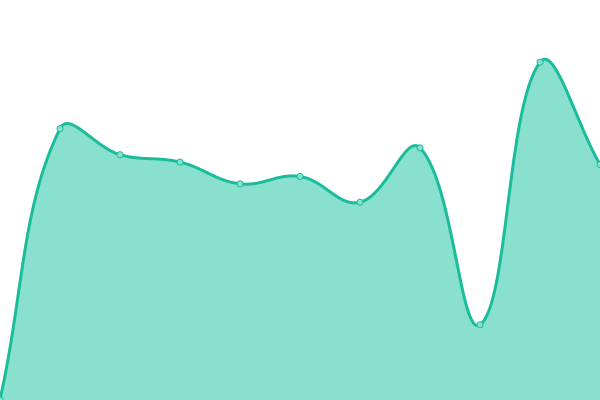
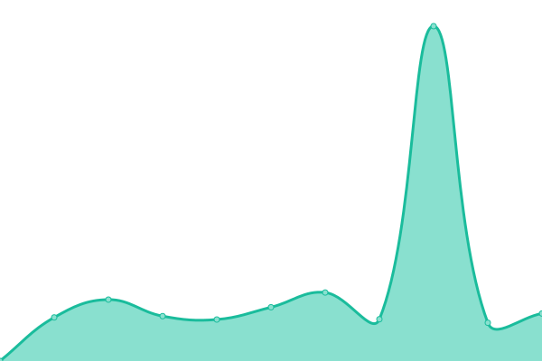

# [📈 Live Status](https://UnivTerbuka.github.io/online): <!--live status--> **Semua sistem beroperasi**

This repository contains the open-source uptime monitor and status page for [Universitas Terbuka](https://www.ut.ac.id/), powered by [Upptime](https://github.com/upptime/upptime).

With [Upptime](https://upptime.js.org), you can get your own unlimited and free uptime monitor and status page, powered entirely by a GitHub repository. We use [Issues](https://github.com/UnivTerbuka/online/issues) as incident reports, [Actions](https://github.com/UnivTerbuka/online/actions) as uptime monitors, and [Pages](https://UnivTerbuka.github.io/online) for the status page.

<!--start: status pages-->
<!-- This summary is generated by Upptime (https://github.com/upptime/upptime) -->
<!-- Do not edit this manually, your changes will be overwritten -->

| URL                                                                                                   | Status | History                                                                                                                                                                                                       | Response Time                                                                                                                            | Uptime                                                                                                                                                                                                                                                                                                                                     |
| ----------------------------------------------------------------------------------------------------- | ------ | ------------------------------------------------------------------------------------------------------------------------------------------------------------------------------------------------------------- | ---------------------------------------------------------------------------------------------------------------------------------------- | ------------------------------------------------------------------------------------------------------------------------------------------------------------------------------------------------------------------------------------------------------------------------------------------------------------------------------------------ |
| [Universitas Terbuka - Making Higher Education Open To All](https://www.ut.ac.id/)                    | Aktif  | [universitas-terbuka-making-higher-education-open-to-all.yml](https://github.com/UnivTerbuka/online/commits/master/history/universitas-terbuka-making-higher-education-open-to-all.yml)                       |  2229ms            |                        |
| [Sistem Informasi Akademik UT](https://sia.ut.ac.id/)                                                 | Aktif  | [sistem-informasi-akademik-ut.yml](https://github.com/UnivTerbuka/online/commits/master/history/sistem-informasi-akademik-ut.yml)                                                                             |  2256ms                                       |                                                                               |
| [E-learning Universitas Terbuka](https://elearning.ut.ac.id/)                                         | Aktif  | [e-learning-universitas-terbuka.yml](https://github.com/UnivTerbuka/online/commits/master/history/e-learning-universitas-terbuka.yml)                                                                         |  5663ms                                     |                                                                           |
| [Mahasiswa UT - Making Higher Education Open To All](https://mahasiswa.ut.ac.id/)                     | Aktif  | [mahasiswa-ut-making-higher-education-open-to-all.yml](https://github.com/UnivTerbuka/online/commits/master/history/mahasiswa-ut-making-higher-education-open-to-all.yml)                                     |  2292ms                   |                                       |
| [APLIKASI TUGAS MATA KULIAH](https://tmk.ut.ac.id/tmkui/#/)                                           | Aktif  | [aplikasi-tugas-mata-kuliah.yml](https://github.com/UnivTerbuka/online/commits/master/history/aplikasi-tugas-mata-kuliah.yml)                                                                                 |  911ms                                          |                                                                                   |
| [Layanan Informasi dan Bantuan - UNIVERSITAS TERBUKA](http://hallo-ut.ut.ac.id/)                      | Aktif  | [layanan-informasi-dan-bantuan-universitas-terbuka.yml](https://github.com/UnivTerbuka/online/commits/master/history/layanan-informasi-dan-bantuan-universitas-terbuka.yml)                                   |  937ms                   |                                     |
| [Perpustakaan UT - Digital Library of A Cyber University of Indonesia](https://www.pustaka.ut.ac.id/) | Aktif  | [perpustakaan-ut-digital-library-of-a-cyber-university-of-indonesia.yml](https://github.com/UnivTerbuka/online/commits/master/history/perpustakaan-ut-digital-library-of-a-cyber-university-of-indonesia.yml) |  1885ms |  |
| [Lembaga Penelitian dan Pengabdian Pada Masyarakat (LPPM) - UT](http://lppm.ut.ac.id/)                | Aktif  | [lembaga-penelitian-dan-pengabdian-pada-masyarakat-lppm-ut.yml](https://github.com/UnivTerbuka/online/commits/master/history/lembaga-penelitian-dan-pengabdian-pada-masyarakat-lppm-ut.yml)                   |  1485ms          |                    |
| [Program Sertifikat Terbuka Online](http://moocs.ut.ac.id/)                                           | Aktif  | [program-sertifikat-terbuka-online.yml](https://github.com/UnivTerbuka/online/commits/master/history/program-sertifikat-terbuka-online.yml)                                                                   |  1231ms                                  |                                                                     |
| [UT RADIO](http://utradio.ut.ac.id/)                                                                  | Aktif  | [ut-radio.yml](https://github.com/UnivTerbuka/online/commits/master/history/ut-radio.yml)                                                                                                                     |  963ms                                                            |                                                                                                                       |
| [Tracer Studi Universitas Terbuka](http://tracer.lppm.ut.ac.id/)                                      | Aktif  | [tracer-studi-universitas-terbuka.yml](https://github.com/UnivTerbuka/online/commits/master/history/tracer-studi-universitas-terbuka.yml)                                                                     |  2239ms                                   |                                                                       |
| [Sistem Unggah Karil PROGRAM PGPAUD DAN PGSD (Pendas)](http://karil.ut.ac.id/pendas/)                 | Aktif  | [sistem-unggah-karil-program-pgpaud-dan-pgsd-pendas.yml](https://github.com/UnivTerbuka/online/commits/master/history/sistem-unggah-karil-program-pgpaud-dan-pgsd-pendas.yml)                                 |  999ms                  |                                   |
| [Sistem Unggah Karil PROGRAM FE, FHISIP, FMIPA, FKIP (Non Pendas)](http://karil.ut.ac.id/nonpendas/)  | Aktif  | [sistem-unggah-karil-program-fe-fhisip-fmipa-fkip-non-pendas.yml](https://github.com/UnivTerbuka/online/commits/master/history/sistem-unggah-karil-program-fe-fhisip-fmipa-fkip-non-pendas.yml)               |  288ms         |                |
| [Situs Web Berbagi Ilmu oleh Staff Universitas Terbuka](http://staff.ut.ac.id/)                       | Aktif  | [situs-web-berbagi-ilmu-oleh-staff-universitas-terbuka.yml](https://github.com/UnivTerbuka/online/commits/master/history/situs-web-berbagi-ilmu-oleh-staff-universitas-terbuka.yml)                           |  1671ms              |                            |
| [Universitas Terbuka Repository](http://repository.ut.ac.id/)                                         | Aktif  | [universitas-terbuka-repository.yml](https://github.com/UnivTerbuka/online/commits/master/history/universitas-terbuka-repository.yml)                                                                         |  1573ms                                     |                                                                           |
| [Promise UT](https://promise.ut.ac.id/)                                                               | Aktif  | [promise-ut.yml](https://github.com/UnivTerbuka/online/commits/master/history/promise-ut.yml)                                                                                                                 |  4388ms                                                         |                                                                                                                   |

<!--end: status pages-->

[**Visit our status website →**](https://UnivTerbuka.github.io/online)

## 📄 License

- Code: [MIT](./LICENSE) © [Universitas Terbuka](https://www.ut.ac.id/)
- Data in the `./history` directory: [Open Database License](https://opendatacommons.org/licenses/odbl/1-0/)
